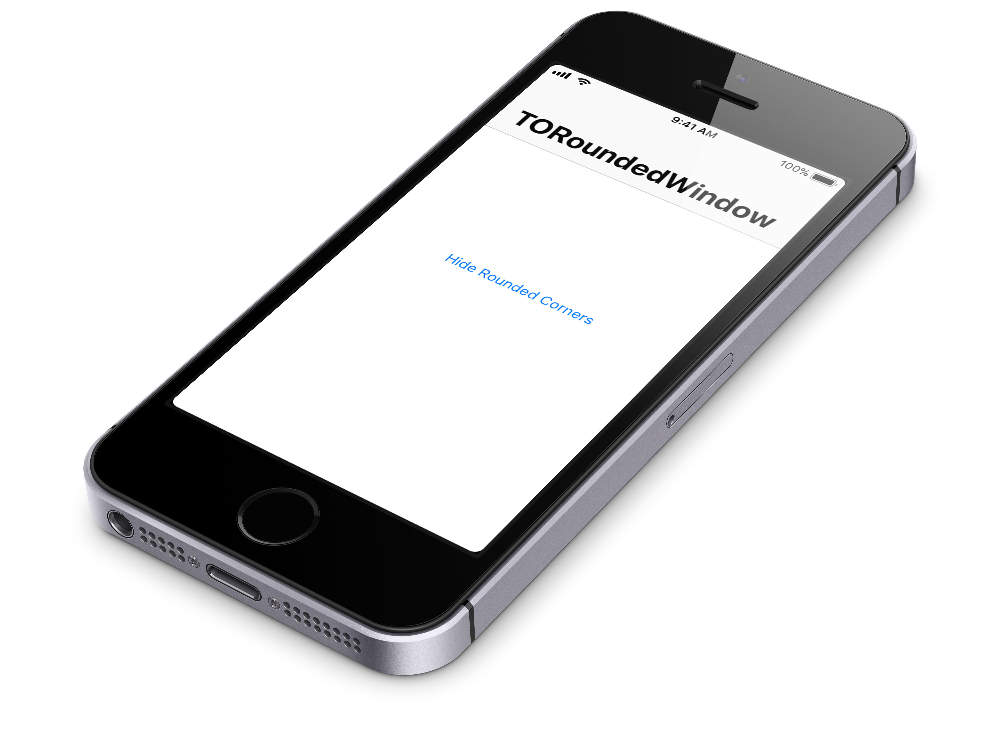

# TORoundedWindow



[](https://cocoapods.org/pods/TORoundedWindow)
[](http://cocoadocs.org/docsets/TORoundedWindow)
[](https://raw.githubusercontent.com/TimOliver/TORoundedWindow/master/LICENSE)
[](http://cocoadocs.org/docsets/TORoundedWindow)
[](https://beerpay.io/TimOliver/TORoundedWindow)
[](https://www.paypal.com/cgi-bin/webscr?cmd=_s-xclick&hosted_button_id=M4RKULAVKV7K8)

`TORoundedWindow` is a `UIWindow` subclass that adds rounded edges to the corners of your iOS app. It can be added at the launch of your app, and can be optionally hidden later if needed.

Rounding the corners of the screen was a standard system level UI feature of iOS all the way to iOS 7. When it launched, iOS 7 did away with the rounded corners, and introduced a very angular style, with many elements like buttons losing their borders, and images becoming square.

iOS 11 featured a very drastic change over the design language introduced in iOS 7. A large number of elements that were originally square (The dock, alerts, buttons, tabs in Music, image thumbnails) were made round, most likely to fit the aesthetic of iPhone X. With this much more 'round' iOS design language, I thought now would be a great time to bring back rounded apps.

# Features

* Can be presented with a single method call, anywhere in the app.
* The size of the corners can be configured.
* If needed, can be animated to hidden, and then animate back.
* Completely unobtrusive. Once made visible, it never needs to be touched again.

# Examples

`TORoundedWindow` has been designed to always be presented outside of you app content, and doesn't need to be managed beyond that.

```objc

#import "TORoundedWindow.h"

[TORoundedWindow show];

```

You can also specify a custom size for the corner elements:

```objc

#import "TORoundedWindow.h"

[TORoundedWindow showWithCornerRadius:10.0f];

```

You can also toggle the visibility of the corners:

```objc

#import "TORoundedWindow.h"

[TORoundedWindow setHidden:YES animated:YES];

```

# Installation

`TORoundedWindow` will work with iOS 7 and above. While written in Objective-C, it should easily import into Swift as well.

## Manual Installation

Copy the contents of the `TORoundedWindow` folder to your app project.

## CocoaPods

```
pod 'TORoundedWindow'
```

## Carthage

Feel free to file a PR. :)

# Why build this?

To be completely honest, I was not happy at the minimal design language of iOS 7. I felt like the Retina Display was being wasted only rendering solid white for the most part.

Now that iOS 11 has started bring back in bordered buttons and is making rounded content views the norm, I'm a lot happier. UI elements with rounded corners 'feel' a lot nicer than straight up squares, and the rounding also lets the Retina Display show off how crisp it really is.

I built this library since I got VERY used to see iOS apps with rounded corners on iPhone X. To the point where using my iPad or iPhone 7 now with its square corners feels 'weird'. I made this library as an experiment to see if an app could adopt having rounded corners again, firstly to make it more in line with iPhone X, and also to revive some semblance of iOS 6.

# Credits

`TORoundedWindow` was created by [Tim Oliver](http://twitter.com/TimOliverAU) as a component of [iComics](http://icomics.co).

# License

`TORoundedWindow` is available under the MIT license. Please see the [LICENSE](LICENSE) file for more information. 
